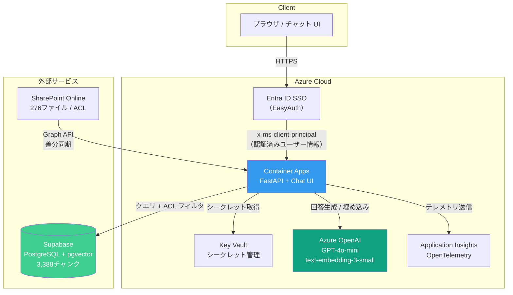
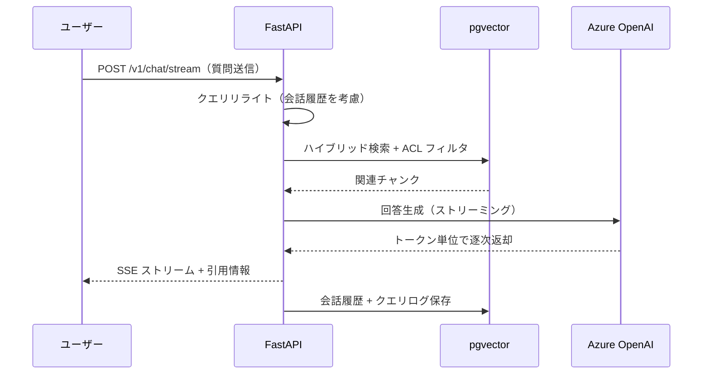

# SharePoint RAG Lite

**SharePoint 文書を ACL 付きで検索できる RAG チャットボット**
Azure AI Search を使わず、pgvector + FastAPI で構築。月額 ¥100〜600 で運用可能。

> 既存の [sharepoint-rag-azure](https://github.com/YuhtaIhara/sharepoint-rag-azure)（Azure AI Search 構成 / 月額 ¥13,000+）の代替として設計・実装した軽量構成。

<!-- デモ GIF を追加予定

-->

---

## リポジトリ構成

```
sharepoint-rag-lite/
│
├── .github/workflows/       CI/CD パイプライン（GitHub Actions）
│   ├── ci.yml                 PR 時: lint + pytest 自動実行
│   └── deploy.yml             main push 時: Docker ビルド → ACR → Container Apps 自動デプロイ
│
├── docs/                    設計書一式（エンタープライズ品質）
│   ├── 01-requirements.md     要件定義書（機能32件 + 非機能9件 + リスク分析）
│   ├── 02-architecture.md     アーキテクチャ設計書（DB設計・ストリーミング・GraphRAG・監視）
│   ├── 03-security.md         セキュリティ設計書（STRIDE脅威モデル・ACL・プロンプトインジェクション防御）
│   ├── 04-resource-design.md  リソース設計書（Azure CAF命名・コスト試算・RBAC）
│   ├── 10-build-guide.md      構築ガイド（Supabase → Azure → デプロイの10ステップ）
│   └── 11-test-spec.md        テスト仕様書（20分類・100ケース）
│
├── src/                     アプリケーションコード
│   ├── api.py                 FastAPI エントリポイント（チャット・ストリーミング・フィードバック・管理API）
│   ├── search.py              ハイブリッド検索 + ACL フィルタリング
│   ├── llm.py                 回答生成 + クエリリライト + ストリーミング
│   ├── ingest.py              SharePoint → pgvector（セマンティックチャンキング）
│   ├── graph_rag.py           エンティティ/関係抽出（GraphRAG パイプライン）
│   ├── config.py              環境変数管理 + Key Vault 連携
│   ├── db.py                  PostgreSQL 接続プール管理
│   └── static/index.html      チャット UI（ビルド不要の単一HTML）
│
├── scripts/                 運用スクリプト
│   ├── evaluate.py            RAG 精度評価パイプライン（LLM-as-Judge 方式）
│   └── cleanup.py             90日超データの自動削除
│
├── tests/                   テストコード
│   ├── test_api.py            pytest ユニットテスト（62ケース）
│   └── conftest.py            テストフィクスチャ（ダミー環境変数 + TestClient）
│
├── .dockerignore              Docker ビルド除外設定
├── .gitignore                 Git 追跡除外設定（.env*, __pycache__ 等）
├── Dockerfile                 コンテナイメージ定義（non-root 実行・HEALTHCHECK 付き）
├── requirements.txt           Python 依存パッケージ一覧
└── run_tests.py               統合テスト実行スクリプト（ACL シナリオ + DB 直接検証）
```

---

## アーキテクチャ



### データフロー（チャット時）



---

## 実績

| 指標 | 目標 | 実績 |
|------|------|------|
| 検索精度 | 70%以上 | **100%**（10/10） |
| ACL 漏洩 | 0件 | **要修正** — 監査で ACL 基盤の欠陥を検出（[詳細](docs/05-acl-remediation.md)） |
| 月額コスト | ¥5,000以下 | **¥100-600**（99%削減） |
| 応答時間（P95） | 8秒以内 | **5.7秒** |
| テストケース | — | ユニット **62件パス** / 結合 **34件中4件NG**（ACL 修正中） |

### コスト内訳（PoC / 10ユーザー）

| リソース | 月額 |
|----------|------|
| Azure OpenAI（GPT-4o-mini + embedding） | ~¥60 |
| Container Apps（Consumption / スケールゼロ） | ~¥0-450 |
| Supabase（Free tier / pgvector） | ¥0 |
| Key Vault + Application Insights | ~¥2 |
| **合計** | **~¥75-525** |

---

## 機能一覧

### コア機能
- **ACL 連動検索** — SharePoint の権限を Graph API で同期し、権限のない文書は検索結果に一切出さない
- **セマンティックチャンキング** — 埋め込みベースの話題検出で文書を意味単位に分割（276ファイル → 3,388チャンク）
- **SSE ストリーミング** — トークン単位のリアルタイム表示（カーソル点滅アニメーション付き）
- **クエリリライト** — 会話履歴を考慮した検索クエリの自動再構成（マルチターン精度向上）
- **根拠リンク** — インライン引用番号 `[1]` + クリック可能な出典カード

### チャット UI（ChatGPT 風）
- 会話履歴サイドバー（Today / Yesterday / Last 7 days で自動分類）
- 新規チャット作成 / 会話削除
- フィードバックボタン（👍👎 → DB に記録して分析可能）
- Markdown レンダリング（太字・リスト・段落）
- モバイル対応（768px 未満でサイドバー自動非表示）

### セキュリティ・運用
- **Entra ID SSO** — EasyAuth によるゼロコード認証
- **Key Vault 統合** — 全シークレットを Key Vault で一元管理
- **レート制限** — slowapi で 10リクエスト/分/ユーザー
- **プロンプトインジェクション防御** — システムプロンプトによるガードレール
- **Application Insights** — OpenTelemetry による自動計装・監視
- **CI/CD** — GitHub Actions → ACR → Container Apps の自動デプロイ
- **データ保持ポリシー** — 90日超のログ・会話を自動削除

### 発展機能
- **GraphRAG** — エンティティ/関係抽出パイプラインによる文書横断推論
- **トークン予算管理** — 長時間会話での自動トランケーション
- **管理者統計 API** — 30日間の利用状況・フィードバック集計・インデックス状態

---

## 技術スタック

| レイヤー | 技術 |
|---------|------|
| 言語 | Python 3.12 |
| API フレームワーク | FastAPI + Uvicorn |
| ベクトル DB | PostgreSQL + pgvector（Supabase） |
| LLM | Azure OpenAI（GPT-4o-mini） |
| 埋め込みモデル | text-embedding-3-small（1536次元） |
| ホスティング | Azure Container Apps（Consumption） |
| 認証 | Entra ID SSO（EasyAuth） |
| シークレット管理 | Azure Key Vault |
| 監視 | Application Insights（OpenTelemetry） |
| CI/CD | GitHub Actions |
| データ連携 | Microsoft Graph API（SharePoint + ACL） |
| テスト | pytest（ユニット62件） + run_tests.py（結合34件） |

---

## セットアップ

### 前提条件
- Python 3.12+
- Supabase アカウント（Free tier）
- Azure サブスクリプション（OpenAI / Container Apps / Key Vault）
- Entra ID アプリ登録（Graph API: Sites.Read.All, Files.Read.All, **GroupMember.Read.All, Directory.Read.All, User.Read.All**）
  - `Sites.Read.All` は SP サイトメンバー展開にも使用。付与できない場合は `SP_SITE_MEMBERS` 環境変数でフォールバック可能

### ローカル起動

```bash
# 依存パッケージインストール
pip install -r requirements.txt

# 環境変数を設定
cp .env.example .env.local
# .env.local を編集して接続情報を記入

# SharePoint 文書をインジェスト
python -m src.ingest

# API 起動
uvicorn src.api:app --host 0.0.0.0 --port 8000
```

### テスト

```bash
# ユニットテスト
python -m pytest tests/ -v

# 統合テスト（DB 接続 + 実メールアドレスが必要）
export TEST_BOSS_EMAIL="boss@example.com"             # 経営+人事+営業 全アクセス
export TEST_MEMBER_EMAIL="member@example.com"         # 人事+営業 アクセス
export TEST_SALES_EMAIL="sales@example.com"           # 営業のみ
export TEST_GENERAL_EMAIL="nobody@example.com"        # アクセスなし
python run_tests.py
```

### デプロイ

```bash
# ACR にイメージをビルド・プッシュ
az acr build --registry <YOUR_ACR_NAME> \
  --image sharepoint-rag-lite:latest --file Dockerfile .

# Container App を更新
az containerapp update \
  --name <YOUR_CONTAINER_APP> \
  --resource-group <YOUR_RESOURCE_GROUP> \
  --image <YOUR_ACR_NAME>.azurecr.io/sharepoint-rag-lite:latest
```

---

## AI Search 構成との比較

| | AI Search 構成（azure） | pgvector 構成（lite） |
|---|---|---|
| 月額コスト | ~¥13,000 | ~¥100-600 |
| Azure リソース数 | 12 | 7 |
| 固定費 | ¥12,750（AI Search + App Service） | ¥0（全て従量課金） |
| 構築時間 | 約90分 | 約40分 |
| 検索エンジン | Azure AI Search（マネージド） | pgvector（SQL ベース） |
| ACL 精度 | 同等 | 同等 |
| 検索精度 | 同等 | 同等 |

---

## ライセンス

MIT
