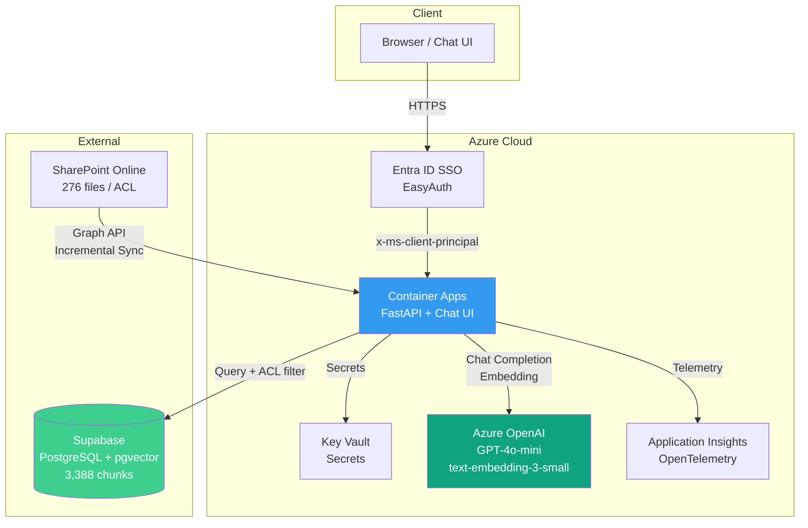
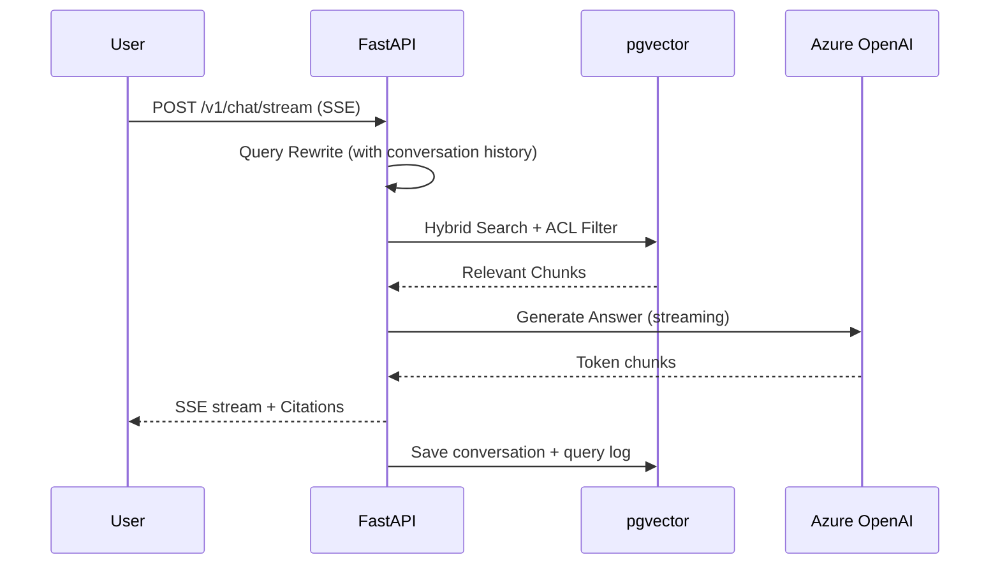

# SharePoint RAG Lite

**SharePoint 文書を ACL 付きで検索できる RAG チャットボット**
Azure AI Search を使わず、pgvector + FastAPI で構築。月額 ¥100〜600 で運用可能。

> 既存の [sharepoint-rag-azure](https://github.com/YuhtaIhara/sharepoint-rag-azure)（Azure AI Search 構成 / 月額 ¥13,000+）の代替として設計・実装した軽量構成。

<!-- デモ GIF を追加予定

-->

---

## Architecture



### Data Flow



---

## Key Results

| Metric | Target | Actual |
|--------|--------|--------|
| Search Accuracy | 70%+ | **100%** (10/10) |
| ACL Leakage | 0 | **0** |
| Monthly Cost | < ¥5,000 | **¥100-600** (99% reduction) |
| Response Time (P95) | < 8s | **5.7s** |
| Test Cases | — | **62 passed** (100 spec'd) |

**Cost Breakdown** (PoC / 10 users):

| Resource | Monthly |
|----------|---------|
| Azure OpenAI (GPT-4o-mini + embedding) | ~¥60 |
| Container Apps (Consumption, scale-to-zero) | ~¥0-450 |
| Supabase (Free tier, pgvector) | ¥0 |
| Key Vault + App Insights | ~¥2 |
| **Total** | **~¥75-525** |

---

## Features

### Core
- **ACL-aware search** — SharePoint permissions synced via Graph API; unauthorized documents never appear in results
- **Semantic chunking** — Embedding-based topic detection splits documents at natural boundaries (3,388 chunks from 276 files)
- **SSE streaming** — Real-time token-by-token response with cursor animation
- **Query rewrite** — Conversation-aware query reformulation for multi-turn accuracy
- **Citation links** — Inline reference numbers `[1]` with clickable source cards

### Chat UI (ChatGPT-style)
- Sidebar with conversation history (Today / Yesterday / Last 7 days)
- New chat / delete conversation
- Feedback buttons (thumbs up/down → stored for analysis)
- Markdown rendering (bold, lists, paragraphs)
- Mobile responsive (sidebar auto-hide on < 768px)

### Security & Operations
- **Entra ID SSO** via EasyAuth (zero-code authentication)
- **Key Vault** integration for all secrets
- **Rate limiting** (10 req/min per user via slowapi)
- **Prompt injection defense** (system prompt guardrails)
- **Application Insights** (OpenTelemetry auto-instrumentation)
- **CI/CD** (GitHub Actions → ACR → Container Apps)
- **Data retention** (90-day auto-cleanup)

### Advanced
- **GraphRAG** — Entity/relation extraction pipeline for cross-document reasoning
- **Token budget management** — Automatic conversation truncation for long sessions
- **Admin stats API** — 30-day usage metrics, feedback aggregation, index status

---

## Tech Stack

| Layer | Technology |
|-------|-----------|
| Language | Python 3.12 |
| API Framework | FastAPI + Uvicorn |
| Vector DB | PostgreSQL + pgvector (Supabase) |
| LLM | Azure OpenAI (GPT-4o-mini) |
| Embedding | text-embedding-3-small (1536 dim) |
| Hosting | Azure Container Apps (Consumption) |
| Auth | Entra ID SSO (EasyAuth) |
| Secrets | Azure Key Vault |
| Monitoring | Application Insights (OpenTelemetry) |
| CI/CD | GitHub Actions |
| Graph API | Microsoft Graph (SharePoint + ACL) |
| Testing | pytest (62 cases) |

---

## Documentation

Full enterprise-grade documentation set:

| Document | Description |
|----------|-------------|
| [Requirements](docs/01-requirements.md) | 32 functional + 9 non-functional requirements, risk analysis |
| [Architecture](docs/02-architecture.md) | Component design, DB schema, streaming, GraphRAG, monitoring |
| [Security](docs/03-security.md) | STRIDE threat model, ACL design, prompt injection defense |
| [Resource Design](docs/04-resource-design.md) | Azure CAF naming, cost estimation, RBAC matrix |
| [Build Guide](docs/10-build-guide.md) | Step-by-step: Supabase → Azure → Deploy (10 steps) |
| [Test Spec](docs/11-test-spec.md) | 100 test cases across 20 categories (A-T) |

---

## Project Structure

```
sharepoint-rag-lite/
├── src/
│   ├── api.py              # FastAPI endpoints (chat, stream, feedback, admin)
│   ├── search.py            # Hybrid search + ACL filtering
│   ├── llm.py               # Answer generation + query rewrite + streaming
│   ├── ingest.py            # SharePoint → pgvector (semantic chunking)
│   ├── graph_rag.py         # Entity/relation extraction (GraphRAG)
│   ├── config.py            # Environment config + Key Vault integration
│   ├── db.py                # Connection pool management
│   └── static/index.html    # Chat UI (single-file, no build step)
├── scripts/
│   ├── evaluate.py          # RAG evaluation pipeline (LLM-as-Judge)
│   └── cleanup.py           # 90-day data retention cleanup
├── tests/
│   ├── test_api.py          # 62 pytest cases
│   └── conftest.py          # Test fixtures
├── docs/                    # 6 design documents (see above)
├── .github/workflows/       # CI (lint + test) / CD (build + deploy)
├── Dockerfile               # Multi-stage, non-root, HEALTHCHECK
└── requirements.txt
```

---

## Quick Start

### Prerequisites
- Python 3.12+
- Supabase account (Free tier)
- Azure subscription (OpenAI, Container Apps, Key Vault)
- Entra ID app registration (Graph API: Sites.Read.All, Files.Read.All)

### Setup

```bash
# Install dependencies
pip install -r requirements.txt

# Configure environment (copy and edit)
cp .env.example .env.local

# Ingest SharePoint documents
python -m src.ingest

# Run locally
uvicorn src.api:app --host 0.0.0.0 --port 8000
```

### Test

```bash
# Unit tests
python -m pytest tests/ -v

# Integration tests (requires DB connection)
export TEST_BOSS_EMAIL="boss@example.com"
export TEST_MEMBER_EMAIL="member@example.com"
export TEST_SALES_EMAIL="sales@example.com"
python run_tests.py
```

### Deploy

```bash
# Build and push to ACR
az acr build --registry <YOUR_ACR_NAME> \
  --image sharepoint-rag-lite:latest --file Dockerfile .

# Update Container App
az containerapp update \
  --name <YOUR_CONTAINER_APP> \
  --resource-group <YOUR_RESOURCE_GROUP> \
  --image <YOUR_ACR_NAME>.azurecr.io/sharepoint-rag-lite:latest
```

---

## Comparison with AI Search Architecture

| | AI Search (azure) | pgvector (lite) |
|---|---|---|
| Monthly cost | ~¥13,000 | ~¥100-600 |
| Azure resources | 12 | 7 |
| Fixed cost | ¥12,750 (AI Search + App Service) | ¥0 (all consumption) |
| Setup time | ~90 min | ~40 min |
| Search engine | Azure AI Search (managed) | pgvector (self-managed SQL) |
| ACL | Same | Same |
| Accuracy | Same | Same |

---

## License

MIT
